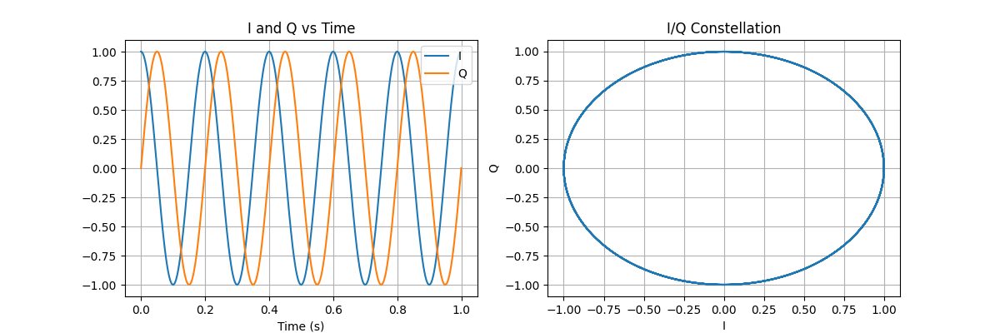

Signal Visualizer & Analyzer

Signal Visualizer & Analyzer is a Python project for generating, visualizing, and analyzing signals in both time and frequency domains.

This project is designed as a learning tool for DSP (Digital Signal Processing) and as a portfolio project to showcase Python, NumPy, Matplotlib, and SciPy skills.
Features

    Generate customizable signals:

        Sine, square, and noise

        Adjustable frequency, amplitude, and phase

    Plot signals in time and frequency domains (FFT)

    Visualize I/Q (In-phase & Quadrature) signals

    Create constellation plots for complex signals

    Save plots to the output/ folder for documentation or reports

Project Structure

signal-visualizer/
│
├─ main.py             # Entry point for running the project
├─ signals.py          # Signal generation and plotting functions
├─ analyze.py          # (Planned) FFT and advanced analysis
├─ requirements.txt    # Python dependencies
│
├─ notebooks/
│   └─ testing.ipynb   # Jupyter notebook for experimentation
│
└─ output/             # Saved plots for README and analysis

Installation

    Clone the repository

    (Optional) Create and activate a virtual environment

    Install the required packages listed in requirements.txt

Usage

    Run main.py to generate and visualize a signal.

    Use the Jupyter notebook in notebooks/testing.ipynb for experiments with different signal parameters.

    Generated plots can optionally be saved to the output/ folder.

Example Output

Example I/Q time-domain and constellation plot:

Future Plans

    CLI menu for interactive signal selection
    Support for chirps and radar-like waveforms